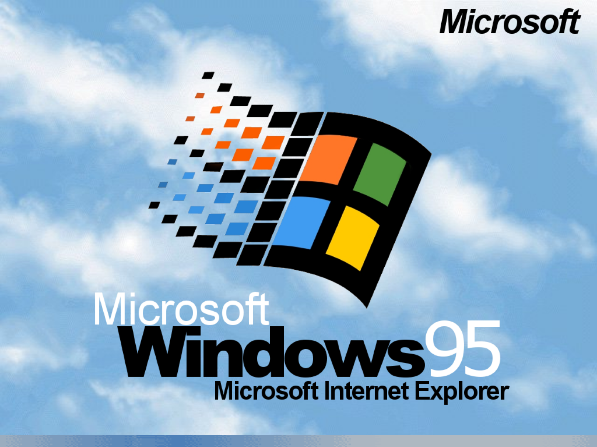

# Windoze95 1080 Plymouth theme

## Disclaimer

I just edited the work of LASZCZ (https://www.pling.com/p/1202357/)

Edits from original :
- Scaled it to 1080p.
- Removed the extra duplicate loading frames of the progress bar cycle.
- Slowed down the progress bar cycle.

## Installation

Just run `./install` to install it.
You can run `./test-plymouth` to display the current bootsplash theme.

## Screenshot

